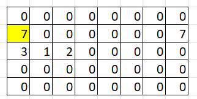
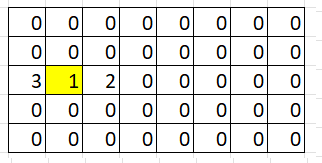
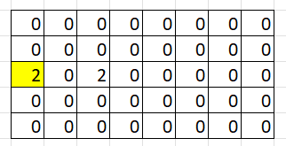
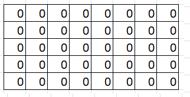
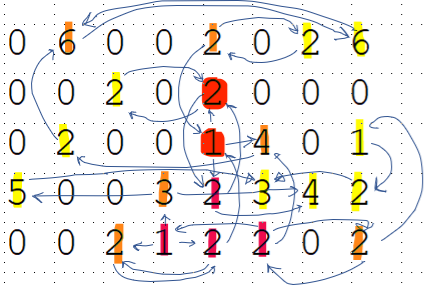

# ClearTheGrid

You are given a grid, filled with numbers. 
You can move a number horizontally or vertically by exactly as many cells as the value of the number. The number has to be pushed on another non-zero number. The moved number will then be added to the other number or subtracted, at your choice. In case of substration, the absolute value will be taken. The goal is to *Clear-The-Grid* and not have any numbers remaining. 

A webversion of the game can be found [here](https://eulerschezahl.github.io/NumberShifting.html)


### Extra clarification of the rules:

Assume you want to move cell A to cell B , then 
- Cell A **must** have a value, you **cannot** start with an empty cell.
- Cell B **must** have a value, you **cannot** land on an empty cell.
- The distance between A and B **must** be the value of cell A, you **cannot** pick a shorter or longer distance.

After your move:
- Cell A is EMPTY
- Cell B value is either the sum (B+A) or the substration (B-A), this is your choice. 
   - In case of a negative value due to the substration, the absolute (positive) value will be Cell B's new value! 


## Example

We will use the first level as an example.
In this level the grid is 8x5 and contains: 



A first action to clear the grid could be to move the left 7 on top of the right 7 and substract it. This will leave us with the board: 



To get rid of the 3,1 and 2. One could move the 1 on top of the 3 and substract it. Resulting in :



To clear the grid, we move one of the 2's on top of the other. The grid is clear! 




## Details

The top left corner has the coordinate (0,0). The X coordinate increases to the right, the Y to the bottom.

### Input file
The level files consist of :
- On the first line the `width` and `height`
- Followed by *`height`* number of lines containing `width` numbers of cell values of the grid.


For example the content of the first level defines a grid of 8 width and 5 height.
``` 
8 5
0 0 0 0 0 0 0 0 
7 0 0 0 0 0 0 7 
3 1 2 0 0 0 0 0 
0 0 0 0 0 0 0 0 
0 0 0 0 0 0 0 0 
```


### Solutions file

You can provide an solution to a level by constructing a file which contains 
- place each *move* on a line
- each line should contain 
   - the `x` and `y` coordinate of the source cell 
   - the direction as one of the uppercase letters [`U`, `D`, `L` or `R`] for the directions : up,down,left or right.
   - your choice for addition or subtraction by writing the `+` or `-` sign. 

A (free!) solution for the first level could be:

```
0 1 R -
1 2 L -
0 2 R -
```

> The first line reads as: take the cell at [0,1] (which is the left 7 in the grid) and move it's value to the right. Substract it from the other 7. This clears out both the 7's. Etc.

### Check your solution

In the source of this repo you find a `Checker` tool to verify if your generated solution file is correct. 

```
checker.exe 12.txt 12.sol
```

### Complex

It can become complex quite quickly 😆




